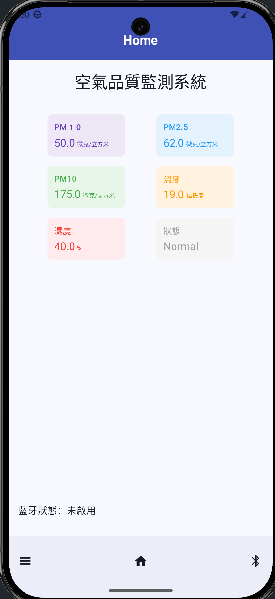
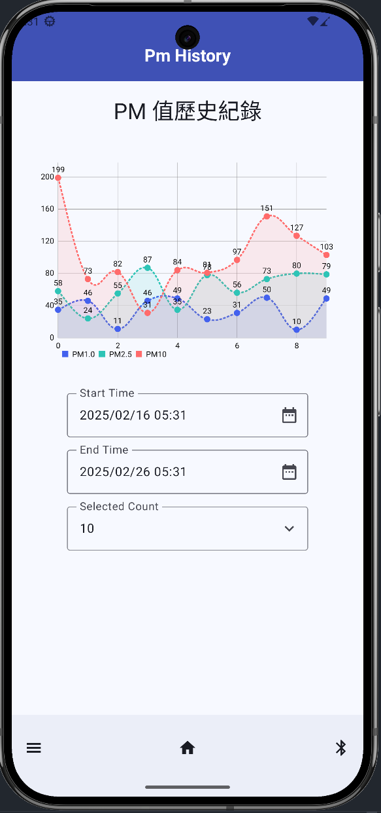
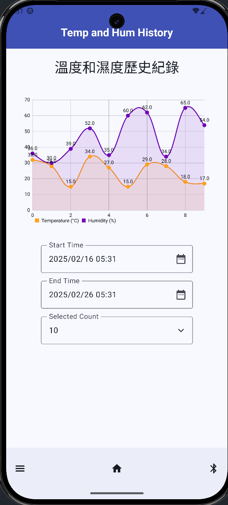
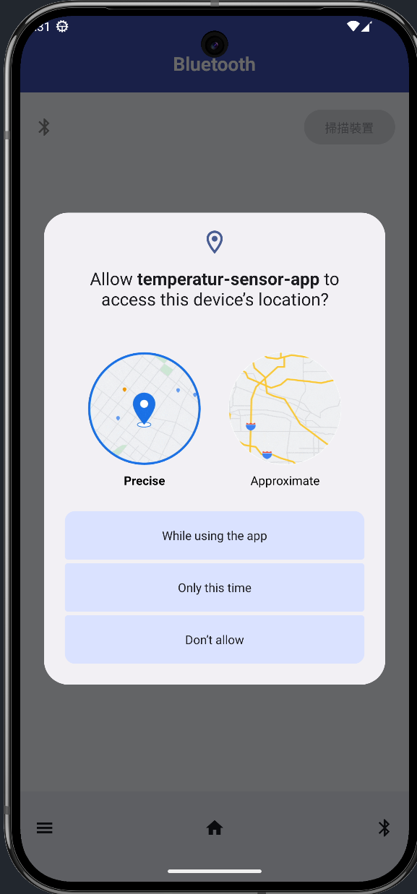

# Reference
# 專案名稱

<h1>
  
  temperature-sensor-app (溫溼度感測 App)
</h1>

## 📱 專案介紹

這是一個專門設計用於與 4.0 藍芽模組 (兼容 HM-10 藍芽) 進行通訊的 Android 應用程式。本應用程式主要功能包括：

- 即時接收並顯示 IoT 裝置傳送的溫溼度數據
- 將感測器數據進行本地存儲與歷史記錄追蹤
- 支援蒐集 pm1.0、pm2.5、pm10、溫度、濕度，等的資料串接

本專案致力於提供一個簡單且直觀的使用者介面，讓使用者能夠輕鬆地監控和管理 IoT 溫溼度感測器的即時數據。

## 🔄 藍芽接收的數據格式

```json
{
  "pm1_0": "double_string",
  "pm2_5": "double_string",
  "pm10_0": "double_string",
  "temperature": "double_string",
  "humidity": "double_string",
  "status": "success or fail description"
}
```

### 截圖展示

<p>
  
  
  
  
</p>

## ✨ 特色功能

- 藍芽設備連接 App，數據分析
- PM 值歷史紀錄 UI
- 溫度和濕度歷史紀錄 UI

## 🛠 技術架構

- 開發語言：[Kotlin/Java]
- 使用 JDK 版本：openjdk 11
- 最低 SDK 版本：Android 8.0 (API Level 26)
- 目標 SDK 版本：Android 15 (API Level 35)

### 使用的主要框架與函式庫

- [Android Jetpack Components](https://developer.android.com/jetpack)
    - ViewModel
    - LiveData
    - Room
    - Navigation
- [Compose Material 3](https://developer.android.com/jetpack/androidx/releases/compose-material3) - UI 介面

## 📦 專案結構說明

```tree
temperatur-sensor-sdk/                 # 專案根目錄
├── 📱 app                             # 應用程式主模組
│   ├── 📁 src/main
│   │   ├── 📁 java                    # 程式碼目錄
│   │   │   └── com.temperature.temperatur_sensor_sdk
│   │   │       ├── 🧩 component      # UI元件、可重用組件
│   │   │       ├── 🔄 convert        # 資料轉換工具類
│   │   │       ├── 💾 dao            # 資料庫存取介面
│   │   │       ├── 📦 entity         # 資料實體類別
│   │   │       ├── 🔀 route          # 畫面導航路由
│   │   │       ├── 🎯 screen         # UI畫面實作
│   │   │       ├── 🎨 ui.theme       # UI主題相關設定
│   │   │       ├── 🛠️ util           # 通用工具類
│   │   │       ├── 📱 MainActivity.kt # 應用程式入口點
│   │   │       └── 🗄️ TemperatureDatabase.kt # 資料庫配置類
│   │   │
│   │   └── 📁 res                     # 資源檔案
│   │       ├── drawable               # 圖片資源
│   │       ├── mipmap-*               # 應用程式圖示
│   │       ├── values                 # 字串、顏色等資源
│   │       └── xml                    # XML配置檔案
│   │
│   ├── 📝 AndroidManifest.xml         # 應用程式配置檔
│   └── 🖼️ ic_temp_hum-playstore.png   # 應用程式商店圖示
```
## 🧩 重要功能參考

**package 代表指向的是一個包，底下包含了該功能的所有代碼**  
**code 代表指向的是一個檔案，該檔案裏面撰寫了功能的業務邏輯**

[藍芽核心功能(package)](app/src/main/java/com/temperature/temperatur_sensor_sdk/component/bluetooth)  
[藍芽接收主程式(code)](app/src/main/java/com/temperature/temperatur_sensor_sdk/component/bluetooth/BluetoothViewModel.kt)  
[畫面的功能選項 - 路由(code)](app/src/main/java/com/temperature/temperatur_sensor_sdk/route/Screen.kt)  
[畫面的功能選項 - UI(code)](app/src/main/java/com/temperature/temperatur_sensor_sdk/component/DrawerContent.kt)  
[日期選擇組件(package)](app/src/main/java/com/temperature/temperatur_sensor_sdk/component/date)  
[數據庫儲存 - 資料格式(code)](app/src/main/java/com/temperature/temperatur_sensor_sdk/entity/TemperatureRecord.kt)  
[數據庫儲存 - 日期轉換格式(code)](app/src/main/java/com/temperature/temperatur_sensor_sdk/convert/DateTimeConverter.kt)  
[數據庫連接 - 核心組件(code)](app/src/main/java/com/temperature/temperatur_sensor_sdk/TemperatureDatabase.kt)  
[應用程式工具組件(code)](app/src/main/java/com/temperature/temperatur_sensor_sdk/util/BluetoothUtil.kt)  
[主程式核心進入點(code)](app/src/main/java/com/temperature/temperatur_sensor_sdk/MainActivity.kt)

## 🚀 安裝說明

1. Clone 專案
   
    ```bash
    git clone https://github.com/Cindle0826/temperatur-sensor-app.git

    ```

2. 下載 Android Studio 並開啟專案
    ```bash
    
    # download Android Studio
    # url: https://developer.android.com/studio
    
    ```

3. 如要安裝可到 Release 最新版 Apk
    ```bash
    
    # url: https://github.com/Cindle0826/temperatur-sensor-app/releases
    
    ```

